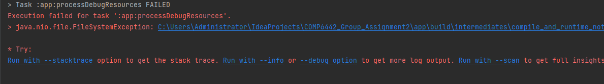
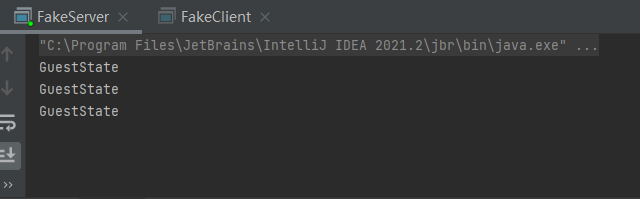
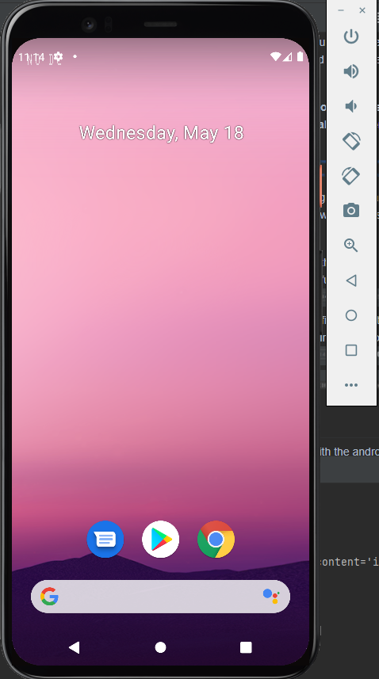
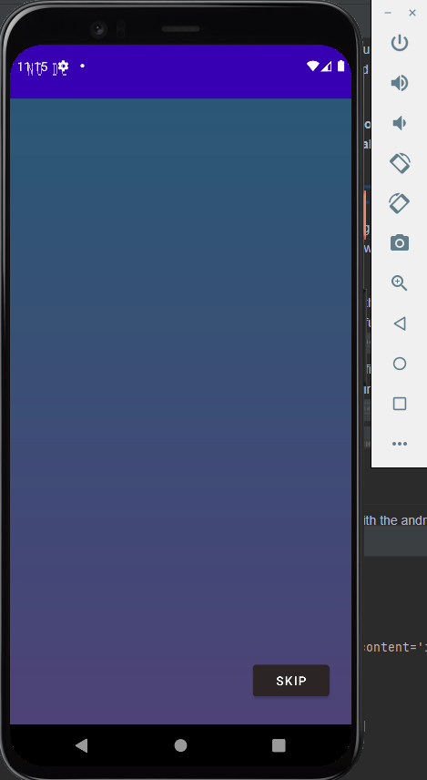
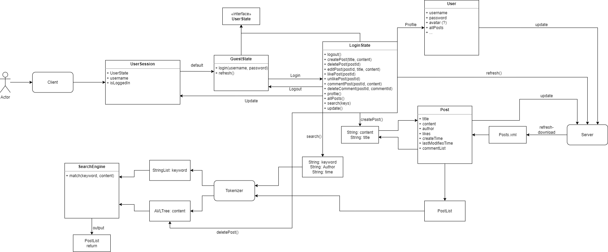

# [Team pi ANU Courtyard App] Report

## Foreword (Critical Information about the Project)

This project is built with a functional server-client model. The client will not function by itself. 

Due to the limitation that the project must be included in one git repository, the server is included together with the client, which the team believe should be in seperated project. 

The server is an executable java class named [FakeServer.java](./app/src/main/java/com/example/comp6442_group_assignment/FakeServerStuff/FakeServer.java) which is used to communicate with the client. 

All functions of the app will run on the server and the client itself only send and receive messages then display them. 

**The android studio does not allow the server to run before the AVD initialized, otherwise exception will occur.**

**Thus, for marking and testing our app, a general step tutorial is provided below: (If accessing by running in Android Studio)**

- [Step 1] Run the app in the android studio and do not attempt any function. 

- [Step 2] Run the [FakeServer.java](./app/src/main/java/com/example/comp6442_group_assignment/FakeServerStuff/FakeServer.java) file and wait till these message appear in the console. 

- [Step 3] Run the [AutoClient](./app/src/main/java/com/example/comp6442_group_assignment/FakeServerStuff/AutoClient.java) file to simulate the data stream. 

- [Step 4] Start interact with the android client. 

**If running with the APK file, the steps are:**
- [Step 1] Run the [FakeServer.java](./app/src/main/java/com/example/comp6442_group_assignment/FakeServerStuff/FakeServer.java) file and wait till these message appear in the console.

- 

- [Step 2] Load the [apk file](./app/build/outputs/apk/debug/app-debug.apk) into the AVD and run the app by drag and drop. 

- [Step 3] Run the [AutoClient](./app/src/main/java/com/example/comp6442_group_assignment/FakeServerStuff/AutoClient.java) file to simulate the data stream.

- [Step 4] Start interact with the android client.

**P.S. Also, the client now only support connection to localhost, thus, client must be run on the same environment as the server.**

**P.S. Also again, once the AutoClient started running, the server file would be changed permanently, if you want to test again freshly, you can always Git Rollback [post.xml](./app/src/main/assets/post.xml) and [user.xml](./app/src/main/assets/user.xml). Of Rollback is not viable, there is a copy to each file in the [backup](./app/src/main/assets/backup) folder that you can replace for.**

If any marker meet any trouble opening or running the app, please contact the team:
- Peicheng Liu (u7294212) by SMS: +61 428 022 807, or by email: u7294212@anu.edu.au if you run the project on Intellij
- Jiyuan Chen (u7055573) by email: u7055573@anu.edu.au if you run the project on Android Studio

## Table of Contents

1. [Team Members and Roles](#team-members-and-roles)
2. [Summary of Individual Contributions](#summary-of-individual-contributions)
3. [Conflict Resolution Protocol](#conflict-resolution-protocol)
4. [Application Description](#application-description)
5. [Application UML](#application-uml)
6. [Application Design and Decisions](#application-design-and-decisions)
7. [Summary of Known Errors and Bugs](#summary-of-known-errors-and-bugs)
8. [Testing Summary](#testing-summary)
9. [Implemented Features](#implemented-features)
10. [Team Meetings](#team-meetings)

## Team Members and Roles

| UID | Name | Role |
| :--- | :----: | ---: |
| u7294212 | Peicheng Liu | Team Leader & Backend lead coder |
| u7055573 | Jiyuan Chen | UI design & Frontend coder |
| u7139999 | Zhidong Piao | Backend co-coder & Search function coder |
| u7297753 | Jun Cheng Zhang | Tester |

## Summary of Individual Contributions

*u7294212, Peicheng Liu, I contribute __% of the code. Here are my contributions:* 

**Complete or Major contribution (propose and implement):**

*Java Code Contribution:*
* Fundamental project structure design
* Server-client model
* File writing and reading
* CreatePostXml.java
* CreateUserXml.java
* FakeClient.java
* FakeServer.java
* AutoClient.java
* DataStreamFileGenerator.java
* PostTokenizer.java
* SearchStringTokenizer.java
* SearchToken.java
* Tokenizer.java
* GuestState.java
* LoggedInState.java
* UserState.java
* Comment.java
* Observer.java
* Post.java
* Subject.java
* User.java
* UserSession.java

*Persistent Data Storage*
* post.xml
* user.xml
* DataStream

*ProjectUML*
* projectUML.drawio.png

*Design Pattern*
* State Design Pattern
* Singleton Design Pattern
* Observer Design Pattern

*Report Writing*
* Conflict Resolution Protocol
* Application Description
* Application UML
* Application Design and Decisions
* Implemented Features
* Team Meetings

*Slide* 
* All slides
* Presentation

**Partial or Minor Contribution (Add-on):**

*Java Code Contribution:*
* Search.java
* StateFunctionTest.java

*Report Writing* 
* Summary of Known Errors and Bugs

*u7055573, Jiyuan Chen, I contribute __% of the code. Here are my contributions:*

**Complete contribution (implement entire frontend):**

*Java Code Contribution:*
* Fragment frontend design
* MainActiviy.java
* Post_RecyclerViewAdapter.java
* RecyclerViewInterface.java
* splashFragment.java
* homeFragment.java
* postFragment.java
* searchFragment.java
* profileFragment.java
* loginFragment.java
* registerFragment.java
* detailsFragment.java
* editFragment.java
* inboxFragment.java

*UI Layout*
* activity_main.xml
* fragment_splash.xml
* fragment_home.xml
* fragment_post.xml
* fragment_search.xml
* fragment_profile.xml
* fragment_login.xml
* fragment_register.xml
* fragment_details.xml
* fragment_edit.xml
* fragment_inbox.xml
* recycler_view_button.xml
* recycler_view_row.xml
* buttom_menu.xml
* my_nav.xml

// TODO: u7139999, u7297753
*[Code Design. What design patterns, data structures, did the involved member propose?]*

*[UI Design. Specify what design did the involved member propose? What tools were used for the design?]*

*[Report Writing. Which part of the report did the involved member write?]*

*[Slide preparation. Were you responsible for the slides?]*

*[Miscellaneous contributions. You are welcome to provide anything that you consider as a contribution to the project or team.]*

## Conflict Resolution Protocol
The team remained conflictless for most of the project period. When conflicts arose, the team generally agree on the opinion of the team leader. 

For the rest of conflicts, the team resolve them by talking through the problem in our regular online meetings on MS Teams and Wechat.

## Application Description
In year 2022, most social communication methods are filled with advertisements or tittytainments designed by enterprises with their data analysis. Many people have been caught in the social dilemma that either not look at the social media and isolate themselves from the world or look at the social media and let tons of garbage information flow into the heads. 

People need a platform for certain communities to hang out at without pressure. 

The ANU Courtyard is designed as a communication platform for students and alumni of ANU to connect to each other. It has the characteristics of a social media platform where users can post and comment on posts, and also can search for posts based on keywords. 

The user group should be limited to ANU students and alumni, however, this involves checking if the user email is valid ANU email, thus, the feature is not implemented. 

Users of the application could exchange experience over the future career of certain majors and specializations, asking questions regarding these areas and so on. 

Of course, users could just share their own thoughts on certain topic or even just share their daily life as an ANU student or alumni. 

The application is called The ANU Courtyard, but it could be ANY UNIVERSITY or SCHOOL Courtyard just by changing the name.

In year 2022, most social communication methods are filled with advertisements or tittytainments designed by enterprises with their data analysis. Many people have chosen not to look at them but it is so hard to find a place just for certain communities to hang out at. 

*One simple example of the application usage is as follows:*
* Pleb is an ANU graduating bachelor student at year 4, with a GPA exactly at 5.0, he is hesitating about next step of his life: continuing on Master's Degree or stepping into the job market, seeking guidance on the ANU Courtyard app. 
* Chad is an ANU Master graduated alumni that has been working in Microsoft for 4 years. He occasionally posts some work experience and memory of studying at ANU onto the ANU Courtyard App. 
* Pleb finds that the posts from Chad is very insightful and would like to know more about the Master's study life and the work life of a Master's graduate. So he chooses to comment under Chad's posts asking questions. 
* Chad receives notification occasionally from Pleb and willing to provide more experience to this young man, so he posted more comments describing his life. 
* After being acknowledged the daily life of a Master's alumni, Pleb thinks that he is still young and has the energy to finish a Master's Degree. Then he firmed up the belief and continued his study.
// FIXME: u7055573

*Target audience of the app:*
* ANU students
* ANU alumni
* ANU stuff

The fundamental idea of the app is to provide a platform for people in certain community could find a place to share their life and thought without disturbance from outside world. The app could suit into many others communities just by changing the name in the UI. 

Thus, the target audience could be any person that involves in a community and would like to receive and share on a platform. 

## Application UML

## Application Design and Decisions

*Please give clear and concise descriptions for each subsections of this part. It would be better to list all the concrete items for each subsection and give no more than `5` concise, crucial reasons of your design. Here is an example for the subsection `Data Structures`:*

**Data Structures**

1. *AVLTree*

   * Objective: AVLTree is used to store post tokens in a dynamic manner.
   * Locations: Line 38 in Search.java
   * Reasons:
     * The main reason of using AVL Tree is to search through the post tokens. The worst case searching time complexity O(log n) is much faster than other data structures.
     * Another reason of using AVL Tree is to dynamically update the post tokens. The worst case updating time complexity O(log n) is much faster than other data structures.

2. *List*

   * Objective: Return value of many methods that involves returning a series of objects. Being used as a way to transfer data among methods.
   * Locations: Input of writeToUser() method in User.java, output of readUsers() method in User.java, ..., etc.
   * Reasons:
     * Comparing to Arrays, lists are much more flexible to manipulate.
     * The team do need to have an efficient way to iterate through data and being able to add or remove items from a series of objects.

3. *LinkedList*
   * Objective: It is used for reading data from a file.
   * Locations: line 177 in User.java, Line 257 in Post.java, etc.
   * Reasons:
     * Inserting items takes O(1) time which is faster than the potential O(n) time complexity of ArrayList.
     * The both User (Username) and Post (PostId) data have unique identifier for each item so accessing by index is not needed. 
     * The number of tokens in the whole post file might be too large for a list to handle it efficiently. 
     
4. *HashMap*

   * Objective: Hash map is used to map the searching weight to the posts.
   * Locations: line 40 in Search.java.
   * Reasons:
     * Hashmap allows the team to store post and weight pair.
     * Both put() and get() methods are O(1) time complexity.
     

**Design Patterns**

1. *State* 

    * Objective: State design pattern is used to handle the state of the user.
    * Locations: UserState.java, GuestState.java, LoggedInState.java, UserSession.java, etc.
    * Reasons: 
      * State design pattern allows the server respond the client different regarding the state of the user.
      * The app is designed in a way guest users could not access many functions. 

2. *Observer* 

    * Objective: Observer design pattern is used to handle the notification of the user. 
    * Locations: Observer.java, Post.java, Subject.java, User.java, etc.
    * Reason: 
      * Observer design pattern allows the user to follow or un follow certain posts. 
      * Observer design pattern allows the server to store and notify users when their followed posts are updated.

3. *Singleton* 

    * Objective: Singleton design pattern is used to make sure there is only one instance of the search engine. 
    * Locations: Search.java. 
    * Reasons: 
      * Singleton design pattern keeps the server to have only one instance of the search engine. 
      * The search engine contains the AVL tree if multiple instances are created it is potentially very stressful for the memory. 

4. *Factory* 

    * Objective: Built-in factory design pattern is used to create post objects from partial inputs. 
    * Locations: PostFactory.java. 
    * Reasons: 
      * Some information is not supposed to be inserted in by the user, such as time of post.
      * Some variables of a post can be initialized with set pattern. 

**Grammar(s)**

Multiple parsers are used in this project. One very significantly related to the course material is the searchString Parser used in search function. 
Since it parse the user input which could be generally random, it uses a set of generalized formal grammar production rules. 
For other grammar used in other parsers, they will be introduced by language description since most of the production rules are hard coded grammar, and some of them may take too much space be written in a formal grammar representation.

*1. Grammar used in searchString Parser:*

*Production Rules:*
* S ::= PT | TP
* P ::= W | W P
* T ::= Ex | E | A | H | T 
* Ex ::= \W
* E ::= 'W'
* A ::= @W
* H ::= #W
* W ::= C | CW 
* C ::= 'A' | 'B' | 'C' | 'D' | 'E' | 'F' | 'G' | 'H' | 'I' | 'J' | 'K' | 'L' | 'M' | 'N' | 'O' | 'P' | 'Q' | 'R' | 'S' | 'T' | 'U' | 'V' | 'W' | 'X' | 'Y' | 'Z' | 'a' | 'b' | 'c' | 'd' | 'e' | 'f' | 'g' | 'h' | 'i' | 'j' | 'k' | 'l' | 'm' | 'n' | 'o' | 'p' | 'q' | 'r' | 's' | 't' | 'u' | 'v' | 'w' | 'x' | 'y' | 'z' | '0' | '1' | '2' | '3' | '4' | '5' | '6' | '7' | '8' | '9' | '_'

S = SearchString

P = Phrase

T = Tag

Ex = ExcludeTag

E = ExactTag

A = AuthorTag

H = HashTag

W = Word 

C = Character

*2. Grammar used in client request message:*

The grammar used in client request message is partially hard coded for each function of the app. A legal request message include one prefix and 0 or more suffixes.

The split between prefix and suffixes or between each suffix are a space character ' '. 

The prefix is two character long lower case letters representing the type of the request. Such as 'lo' for logout. 

The server will check the prefix first to determine the number if suffixes needed. 

Depending on the prefix type, the suffixes are different and optional. Such as 'lo' for logout does not need a suffix, 'li' for login need two suffixes one for username and the other one for password. 

For more details please refer to the [client file](./app/src/main/java/com/example/comp6442_group_assignment/FakeServerStuff/FakeServer.java) getResponse() method.

*3. Grammar used in server response message:*

Similar to the client request message, the grammar used in server response message is partially hard coded for each function of the app. A legal response message include one prefix and 0 or more suffixes.

The split between prefix and suffixes or between each suffix are a semicolon character ';'.

The prefix is three character long lower case letters representing the type of the response, which represent the success or failure of the request. Such as 'lis' for login successful and 'lif' for login failed. 

Depending on the prefix type, the suffixes are different and optional. Such as 'lis' for login successful has 5 suffixes indicating the profile information of the user, 'lif' for login unsuccessful has only one suffix which is the error message with the reason of the failure.

For more details please refer to the [client file](./app/src/main/java/com/example/comp6442_group_assignment/FakeServerStuff/FakeServer.java) getResponse() method.

**Tokenizer and Parsers**

Multiple tokenizers and parsers are used in this project. 

There are two significant tokenizers and one parser that was coded into standalone classes and all of them are used for the search function. 

Details of tokenizer involving server-client request and response messages are included in the Grammar section above. 

*1. SearchString Tokenizer:* 
The searchString tokenizer is used to tokenize the search string. It implements the tokenizer interface, takes a String input and return tokens with type of SearchToken which has 5 different types. 

The advantage of using this tokenizer is that it produces different types of tokens that are easier to handle and process for the SearchString parser. 

*2. Post Tokenizer:* 
The post tokenizer is used to extract author and the post content from a post object and tokenizer them into String segments. 

The tokenizer comes with a getAllTokens() method that returns a list of Strings starting with the author and continuing with each word in the post content. 

The advantage of using this tokenizer is that it takes a post object as input so the content and author do not need to be extracted by the parser. It also allows the parser to easily determine the parent post of each token when inserting them into the AVL tree. 

Since the post content does not need to be parsed, the tokenizer also saves some time and space complexity by retaining the String type of the content and author that it is easier to be processed by the parser. 

*3. SearchString Parser:* 
// TODO: u7139999

*4. Response Message Parser:* 
This response message parser is used to split the response message from the server, then convert string of response into List of Post object. The method is setupPost(String response) in homeFragment.java.

**Other**

*[What other design decisions have you made which you feel are relevant? Feel free to separate these into their own subheadings.]*

## Summary of Known Errors and Bugs
1. *The server thread will malfunction if input request String is not valid.*
- Consequence: The server thread will terminate if the input request String is not valid. Both server and clients must be restarted to function again. 
- Current Fix: The client request message pattern is hard coded on the android client side. Invalid input is forbid by the android client. For the manual test client, it must be handled with cautious and referring to the grammar encoded in the FakeServer.java. 

2. *Disconnecting a client from the server will cause SocketException*
- Consequence: The server will automatically re-engage when client tries to reconnect. The userSession will not be obtained. 
- Current Fix: So far there is no fix to this bug, but this is determined as a minor bug since it does not affect the functionality of the server or the client seriously. The current drawback of this bug is after the client is disconnected, the client must be restarted twice, the first one will crash and the second reconnection will function normally. 

// TODO: u7297753
*[Where are the known errors and bugs? What consequences might they lead to?]*

*Here is an example:*

1. *Bug 1:*

- *A space bar (' ') in the sign in email will crash the application.*
- ...

2. *Bug 2:*
3. ...

*List all the known errors and bugs here. If we find bugs/errors that your team does not know of, it shows that your testing is not thorough.*

## Testing Summary
// TODO: u7297753
*[What features have you tested? What is your testing coverage?]*

*Here is an example:*

*Number of test cases: ...*

*Code coverage: ...*

*Types of tests created: ...*

*Please provide some screenshots of your testing summary, showing the achieved testing coverage. Feel free to provide further details on your tests.*

## Implemented Features

*UI Design and Testing*
1. *Feature 1: Users may use portrait and landscape layout or different sized screens to access the app. (easy)*
- The application has different layout xml for both portrait and landscape, and different sized screens. landscape layouts are designed for landscape mode.

*User Interactivity*
1. *Feature 1: Users may micro-interact with items such as like/dislike/edit a post. (easy)*
- likePost(), dislikePost(), editPost() methods in [UserSession class](./app/src/main/java/com/example/comp6442_group_assignment/UserSession.java)
- likePost(), dislikePost(), editPost() methods in [LoggedInState class](./app/src/main/java/com/example/comp6442_group_assignment/State/LoggedInState.java)
- likePost(), dislikePost(), editPost() methods in [Post class](./app/src/main/java/com/example/comp6442_group_assignment/Post.java)
- likeListener, dislikeListener methods in [homeFragment class][detailsFragment class][searchFragment class](./app/src/main/java/com/example/comp6442_group_assignment/Fragment)
- editPostListener method in [detailsFragment class][editFragment class](./app/src/main/java/com/example/comp6442_group_assignment/Fragment)

2. *Feature 2: Users may follow/unfollow a post, and this information will be stored in server. (medium)*
- followPost(), unfollowPost() methods in [UserSession class](./app/src/main/java/com/example/comp6442_group_assignment/UserSession.java)
- followPost(), unfollowPost() methods in [LoggedInState class](./app/src/main/java/com/example/comp6442_group_assignment/State/LoggedInState.java)
- followPost(), unfollowPost() methods in [Post class](./app/src/main/java/com/example/comp6442_group_assignment/Post.java)
- frontend of follow and unfollow post is defined in [code234-249::detailsFragment class](./app/src/main/java/com/example/comp6442_group_assignment/Fragment)

3. *Feature 3: Users will be notified when their followed posts are updated in different ways. (medium)* 
- update() method in [User class](./app/src/main/java/com/example/comp6442_group_assignment/User.java)
- notifyObserversEdit(), notifyObserversComment(), notifyObserversLike() methods in [Post class](./app/src/main/java/com/example/comp6442_group_assignment/Post.java)
- all frontend method control the notifications are in [inboxFragment class](./app/src/main/java/com/example/comp6442_group_assignment/Fragment)

*Privacy* 
1. *Feature 1: Users may only see other's profile if the profile is public. (easy)*
- requestProfile() method in [UserSession class](./app/src/main/java/com/example/comp6442_group_assignment/UserSession.java) 
- requestProfile() method in [LoggedInState class](./app/src/main/java/com/example/comp6442_group_assignment/State/LoggedInState.java)
- requestProfile() method in [User class](./app/src/main/java/com/example/comp6442_group_assignment/User.java)
- frontend listener and method of this part are defined in [code144-158::detailsFragment class][otherProfileFragment class]

*Greater Data Usage, Handling and Sophistication* 
1. *Feature 1: Read and write data instances from multiple local files in different formats (XML and Bespoke)*
- readUsers(), writeToUser() methods in [User class](./app/src/main/java/com/example/comp6442_group_assignment/User.java)
- readFromPost(), writeToPost() methods in [Post class](./app/src/main/java/com/example/comp6442_group_assignment/Post.java)
- Line 27-50 of main method in [AutoClient class](./app/src/main/java/com/example/comp6442_group_assignment/FakeServerStuff/AutoClient.java)
- [DataStreamFileGenerator class](./app/src/main/java/com/example/comp6442_group_assignment/FakeServerStuff/DataStreamFileGenerator.java)

2. *Feature 2: Users could delete their own posts and its content will be deleted from the server side search Tree (AVL deletion). (hard)*
- addToPost(), removeFromPost() methods in [Post class](./app/src/main/java/com/example/comp6442_group_assignment/Post.java) 
- insert(), delete() methods in [Search class](./app/src/main/java/com/example/comp6442_group_assignment/Search/Search.java)
// TODO: u7139999

*Search* 
1. *Feature 1: Users may search for posts by keywords, partially errored keyword would also be handled. (medium)*
- Line 509-522 in [FakeServer class](./app/src/main/java/com/example/comp6442_group_assignment/FakeServerStuff/FakeServer.java)
// TODO: u7139999

*Basic* 
1. *Feature 1: Users may create a new account and sign in. (basic)* 
- login(), register() methods in [UserSession class](./app/src/main/java/com/example/comp6442_group_assignment/UserSession.java)
- login(), register() methods in [GuestState class](./app/src/main/java/com/example/comp6442_group_assignment/State/GuestState.java) 
- registerListener methods are in [registerFragment class](./app/src/main/java/com/example/comp6442_group_assignment/Fragment)

2. *Feature 2: Users may request for server to load data/information from xml file and visualize it in the client. (basic)*
- Line 377-387 in [FakeServer class](./app/src/main/java/com/example/comp6442_group_assignment/FakeServerStuff/FakeServer.java)
- every fragment class has a AsyncTask method used to sent request to server and receive response from server. All information client get are based on the response from the server.

3. *Feature 3: Users may request for server to search information on the app. (basic)*
- Line 509-522 in [FakeServer class](./app/src/main/java/com/example/comp6442_group_assignment/FakeServerStuff/FakeServer.java)
- searchListener methods are in [searchFragment class](./app/src/main/java/com/example/comp6442_group_assignment/Fragment)
// TODO: u7139999

4. *Feature 4: There is a standalone executable class to simulate actions from other users containing 3000+ data instances. (basic)*
- [AutoClient class](./app/src/main/java/com/example/comp6442_group_assignment/FakeServerStuff/AutoClient.java)

## Team Meetings

- *[Team Meeting 1](ReportStuff/meeting2022-4-10.docx)*
- *[Team Meeting 2](ReportStuff/meeting2022-4-23.docx)*
- *[Team Meeting 3](ReportStuff/meeting2022-4-27.docx)*
- *[Team Meeting 4](ReportStuff/meeting2022-5-12.docx)*
- *[Team Meeting 5](ReportStuff/meeting2022-5-14.md)*
- *[Team Meeting 6](ReportStuff/meeting2022-5-16.md)* 
- *[Team Meeting 7](ReportStuff/meeting2022-5-17.md)*

