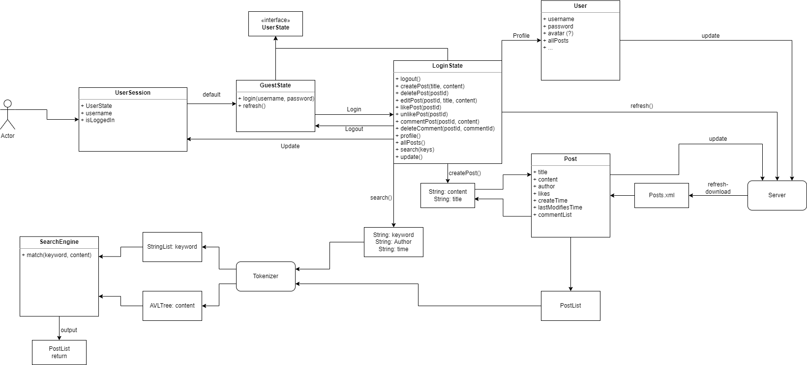

# [Team 70's] Report

The following is a report template to help your team successfully provide all the details necessary for your report in a structured and organised manner. Please give a straightforward and concise report that best demonstrates your project. Note that a good report will give a better impression of your project to the reviewers.

*Here are some tips to write a good report:*

* *Try to summarise and list the `bullet points` of your project as many as possible rather than give long, tedious paragraphs that mix up everything together.*

* *Try to create `diagrams` instead of text descriptions, which are more straightforward and explanatory.*

* *Try to make your report `well structured`, which is easier for the reviewers to capture the necessary information.*

*We give instructions enclosed in square brackets [...] and examples for each sections to demonstrate what are expected for your project report.*

*Please remove the instructions or examples in `italic` in your final report.*

## Table of Contents

1. [Team Members and Roles](#team-members-and-roles)
2. [Summary of Individual Contributions](#summary-of-individual-contributions)
3. [Conflict Resolution Protocol](#conflict-resolution-protocol)
4. [Application Description](#application-description)
5. [Application UML](#application-uml)
6. [Application Design and Decisions](#application-design-and-decisions)
7. [Summary of Known Errors and Bugs](#summary-of-known-errors-and-bugs)
8. [Testing Summary](#testing-summary)
9. [Implemented Features](#implemented-features)
10. [Team Meetings](#team-meetings)

## Team Members and Roles

| UID | Name | Role |
| :--- | :----: | ---: |
| u7294212 | Peicheng | Team Leader & Backend lead coder |
| u7055573 | Jiyuan Chen | UI design & Frontend coder |
| u7139999 | Zhidong Piao | Backend co-coder & Search function coder |
| [uid] | [name] | [role] |

## Summary of Individual Contributions

*[Summarise the contributions made by each member to the project, e.g. code implementation, code design, UI design, report writing, etc.]*

*[Code Implementation. Which features did you implement? Which classes or methods was each member involved in? Provide an approximate proportion in pecentage of the contribution of each member to the whole code implementation, e.g. 30%.]*

*Here is an example:*

*UID1, Name1, I contribute 30% of the code. Here are my contributions:*
* A.class
* B.class: function1(), function2(), ...
* ....

*u7294212, Peicheng Liu, I contribute __% of the code. Here are my contributions:* 

**Complete or Major contribution:**

*Java Code Contribution:*
* Fundamental project structure design
* Server-client model
* CreatePostXml.java
* CreateUserXml.java
* FakeClient.java
* FakeServer.java
* AutoClient.java
* DataStreamFileGenerator.java
* PostTokenizer.java
* SearchStringTokenizer.java
* SearchToken.java
* Tokenizer.java
* GuestState.java
* LoggedInState.java
* UserState.java
* Comment.java
* Observer.java
* Post.java
* Subject.java
* User.java
* UserSession.java

*Persistent Data Storage*
* post.xml
* user.xml
* DataStream

*ProjectUML*
* projectUML.png

*Design Pattern*
* State Design Pattern
* Singleton Design Pattern
* Observer Design Pattern

*Report Writing*

**Partial or Minor Contribution:**
* Search.java
* StateFunctionTest.java

*[Code Design. What design patterns, data structures, did the involved member propose?]*

*[UI Design. Specify what design did the involved member propose? What tools were used for the design?]*

*[Report Writing. Which part of the report did the involved member write?]*

*[Slide preparation. Were you responsible for the slides?]*

*[Miscellaneous contributions. You are welcome to provide anything that you consider as a contribution to the project or team.]*

## Conflict Resolution Protocol
The team remained conflictless for most of the project period. When conflicts arose, the team generally agree on the opinion of the team leader. 

For the rest of conflicts, the team resolve them by talking through the problem in our regular online meetings on MS Teams and Wechat.

## Application Description
In year 2022, most social communication methods are filled with advertisements or tittytainments designed by enterprises with their data analysis. Many people have been caught in the social dilemma that either not look at the social media and isolate themselves from the world or look at the social media and let tons of garbage information flow into the heads. 

People need a platform for certain communities to hang out at without pressure. 

The ANU Courtyard is designed as a communication platform for students and alumni of ANU to connect to each other. It has the characteristics of a social media platform where users can post and comment on posts, and also can search for posts based on keywords. 

The user group should be limited to ANU students and alumni, however, this involves checking if the user email is valid ANU email, thus, the feature is not implemented. 

Users of the application could exchange experience over the future career of certain majors and specializations, asking questions regarding these areas and so on. 

Of course, users could just share their own thoughts on certain topic or even just share their daily life as an ANU student or alumni. 

The application is called The ANU Courtyard, but it could be ANY UNIVERSITY or SCHOOL Courtyard just by changing the name.

In year 2022, most social communication methods are filled with advertisements or tittytainments designed by enterprises with their data analysis. Many people have chosen not to look at them but it is so hard to find a place just for certain communities to hang out at. 

*One simple example of the application usage is as follows:*
* Pleb is an ANU graduating bachelor student at year 4, with a GPA exactly at 5.0, he is hesitating about next step of his life: continuing on Master's Degree or stepping into the job market, seeking guidance on the ANU Courtyard app. 
* Chad is an ANU Master graduated alumni that has been working in Microsoft for 4 years. He occasionally posts some work experience and memory of studying at ANU onto the ANU Courtyard App. 
* Pleb finds that the posts from Chad is very insightful and would like to know more about the Master's study life and the work life of a Master's graduate. So he chooses to comment under Chad's posts asking questions. 
* Chad receives notification occasionally from Pleb and willing to provide more experience to this young man, so he posted more comments describing his life. 
* After being acknowledged the daily life of a Master's alumni, Pleb thinks that he is still young and has the energy to finish a Master's Degree. Then he firmed up the belief and continued his study. 

*Target audience of the app:*
* ANU students
* ANU alumni
* ANU stuff

The fundamental idea of the app is to provide a platform for people in certain community could find a place to share their life and thought without disturbance from outside world. The app could suit into many others communities just by changing the name in the UI. 

Thus, the target audience could be any person that involves in a community and would like to receive and share on a platform. 

*[What is your application, what does it do? Include photos or diagrams if necessary]*

*Here is a pet specific application example*

*PetBook is a social media application specifically targetting pet owners... it provides... certified practitioners, such as veterians are indicated by a label next to their profile...*

**Application Use Cases and or Examples**

*[Provide use cases and examples of people using your application. Who are the target users of your application? How do the users use your application?]*

*Here is a pet training application example*

*Molly wants to inquiry about her cat, McPurr's recent troublesome behaviour*
1. *Molly notices that McPurr has been hostile since...*
2. *She makes a post about... with the tag...*
3. *Lachlan, a vet, writes a reply to Molly's post...*
4. ...
5. *Molly gives Lachlan's reply a 'tick' response*

*Here is a map navigation application example*

*Targets Users: Drivers*

* *Users can use it to navigate in order to reach the destinations.*
* *Users can learn the traffic conditions*
* ...

*Target Users: Those who want to find some good restaurants*

* *Users can find nearby restaurants and the application can give recommendations*
* ...

*List all the use cases in text descriptions or create use case diagrams. Please refer to https://www.visual-paradigm.com/guide/uml-unified-modeling-language/what-is-use-case-diagram/ for use case diagram.*

## Application UML

## Application Design and Decisions

*Please give clear and concise descriptions for each subsections of this part. It would be better to list all the concrete items for each subsection and give no more than `5` concise, crucial reasons of your design. Here is an example for the subsection `Data Structures`:*

**Data Structures**

1. *AVLTree*

   * Objective: AVLTree is used to store post tokens in a dynamic manner.
   * Locations: Line 38 in Search.java
   * Reasons:
     * The main reason of using AVL Tree is to search through the post tokens. The worst case searching time complexity O(log n) is much faster than other data structures.
     * Another reason of using AVL Tree is to dynamically update the post tokens. The worst case updating time complexity O(log n) is much faster than other data structures.

2. *List*

   * Objective: Return value of many methods that involves returning a series of objects. Being used as a way to transfer data among methods.
   * Locations: Input of writeToUser() method in User.java, output of readUsers() method in User.java, ..., etc.
   * Reasons:
     * Comparing to Arrays, lists are much more flexible to manipulate.
     * The team do need to have an efficient way to iterate through data and being able to add or remove items from a series of objects.

3. *LinkedList*
   * Objective: It is used for reading data from a file.
   * Locations: line 177 in User.java, Line 257 in Post.java, etc.
   * Reasons:
     * Inserting items takes O(1) time which is faster than the potential O(n) time complexity of ArrayList.
     * The both User (Username) and Post (PostId) data have unique identifier for each item so accessing by index is not needed. 
     
4. *HashMap*

   * Objective: Hash map is used to map the searching weight to the posts.
   * Locations: line 40 in Search.java.
   * Reasons:
     * Hashmap allows the team to store post and weight pair.
     * Both put() and get() methods are O(1) time complexity.
     

**Design Patterns**

1. *State* 

    * Objective: State design pattern is used to handle the state of the user.
    * Locations: UserState.java, GuestState.java, LoggedInState.java, UserSession.java, etc.
    * Reasons: 
      * State design pattern allows the server respond the client different regarding the state of the user.
      * The app is designed in a way guest users could not access many functions. 

2. *Observer* 

    * Objective: Observer design pattern is used to handle the notification of the user. 
    * Locations: Observer.java, Post.java, Subject.java, User.java, etc.
    * Reason: 
      * Observer design pattern allows the user to follow or un follow certain posts. 
      * Observer design pattern allows the server to store and notify users when their followed posts are updated.

3. *Singleton* 

    * Objective: Singleton design pattern is used to make sure there is only one instance of the search engine. 
    * Locations: Search.java. 
    * Reasons: 
      * Singleton design pattern keeps the server to have only one instance of the search engine. 
      * The search engine contains the AVL tree if multiple instances are created it is potentially very stressful for the memory. 

4. *Factory* 

    * Objective: Built-in factory design pattern DocumentBuilderFactory is being invoked when reading and writing data from/to a file.
    * Locations: Line 172 in User.java, etc.

**Grammar(s)**

Multiple parsers are used in this project. One very significantly related to the course material is the searchString Parser used in search function. 
Since it parse the user input which could be generally random, it uses a generalized formal grammar. 
For other grammar used in other parsers, they will be introduced by language description since most of them are hard coded grammar, and some of them may take too much space be written in a formal grammar representation.

* Grammar used in searchString Parser
  *Production Rules*  
\<Non-Terminal> ::= \<some output>
 
\<Non-Terminal> ::= \<some output>
* Grammar used in client request message 
* Grammar used in server response message 
* Grammar used for client to parse server response message

**Tokenizer and Parsers**

*[Where do you use tokenisers and parsers? How are they built? What are the advantages of the designs?]*

**Surpise Item**

*[If you implement the surprise item, explain how your solution addresses the surprise task. What decisions do your team make in addressing the problem?]*

**Other**

*[What other design decisions have you made which you feel are relevant? Feel free to separate these into their own subheadings.]*

## Summary of Known Errors and Bugs

*[Where are the known errors and bugs? What consequences might they lead to?]*

*Here is an example:*

1. *Bug 1:*

- *A space bar (' ') in the sign in email will crash the application.*
- ...

2. *Bug 2:*
3. ...

*List all the known errors and bugs here. If we find bugs/errors that your team does not know of, it shows that your testing is not thorough.*

## Testing Summary

*[What features have you tested? What is your testing coverage?]*

*Here is an example:*

*Number of test cases: ...*

*Code coverage: ...*

*Types of tests created: ...*

*Please provide some screenshots of your testing summary, showing the achieved testing coverage. Feel free to provide further details on your tests.*

## Implemented Features

*[What features have you implemented?]*

*Here is an example:*

*UI Design and Testing*
1. *Feature 1: Users may use portrait and landscape layout or different sized screens to access the app. (easy)*

*User Interactivity*
1. *Feature 1: Users may micro-interact with items such as like/dislike a post. (easy)*
2. *Feature 2: Users may follow/unfollow a post, and this information will be stored in server. (medium)*
3. *Feature 3: Users will be notified when their followed posts are updated. (medium)* 

*Privacy* 
1. *Feature 1: Users may only see other's profile if the profile is public. (easy)*

*Greater Data Usage, Handling and Sophistication* 
1. *Feature 1: Read and write data instances from multiple local files in different formats (XML and Bespoke)*
2. *Feature 2: Users could delete their own posts and its content will be deleted from the server side search Tree (AVL deletion). (hard)*

*Search* 
1. *Feature 1: Users may search for posts by keywords, partially errored keyword would also be handled. (medium)*

## Team Meetings

*Here is an example:*

- *[Team Meeting 1](ReportStuff/meeting2022-4-10.docx)*
- *[Team Meeting 2](ReportStuff/meeting2022-4-23.docx)*
- *[Team Meeting 3](ReportStuff/meeting2022-4-27.docx)*
- *[Team Meeting 4](ReportStuff/meeting2022-5-12.docx)*
- *[Team Meeting 5](ReportStuff/meeting2022-5-14.md)*

